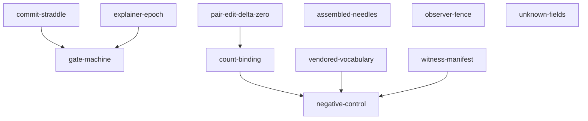

# psychic-repurpose

The blueprint gallery — **11 blueprints**, each a pattern that ran as enforced law somewhere in
the psychic-crew program before it was allowed to become advice here. Every blueprint answers
five questions: What is it, Why does it exist (the defect class it kills), When to reach for it,
where it is Proven, and How to re-instantiate it step by step. Each also carries machine
frontmatter — id, defect class, triggers, requires — the graph that `docs/PULL-INDEX.md`
projects: **11 capabilities**, one per blueprint, with the `requires` closure precomputed.

**PUBLIC** since an out-of-band flip after creation (flip date unrecorded — gh pushedAt matches
the birth commit; ratified 2026-08-31, see the VIS-RECONCILE ledger row). Private at creation.

| Blueprint | Kills |
|---|---|
| [`gate-machine`](blueprints/gate-machine.md) | `sentiment-approval` — approval inferred from sentiment |
| [`count-binding`](blueprints/count-binding.md) | `unbound-figure-drift` — documented figures drifting from live totals |
| [`negative-control`](blueprints/negative-control.md) | `never-seen-failing` — checkers never seen failing (and controls that pass vacuously) |
| [`commit-straddle`](blueprints/commit-straddle.md) | `green-early-or-stale` — the green-early-or-stale-forever dilemma at gated commits |
| [`pair-edit-delta-zero`](blueprints/pair-edit-delta-zero.md) | `dual-doc-divergence` — two documents describing one structure, diverging |
| [`witness-manifest`](blueprints/witness-manifest.md) | `untracked-state-drift` — untracked working-state drift between commits |
| [`vendored-vocabulary`](blueprints/vendored-vocabulary.md) | `brittle-or-silent-coupling` — cross-repo coupling that is either brittle or silent |
| [`unknown-fields`](blueprints/unknown-fields.md) | `guessed-in-requirements` — complete-looking artifacts hiding guessed-in requirements |
| [`observer-fence`](blueprints/observer-fence.md) | `measurement-mutates` — measurement that mutates the state it measures |
| [`assembled-needles`](blueprints/assembled-needles.md) | `scanner-contains-prey` — scanners containing their own prey; docs that trip deny rules |
| [`explainer-epoch`](blueprints/explainer-epoch.md) | `opaque-gate-change` — gated changes only their author can read |

## The graph, rendered

Derived from the same frontmatter the index projects — the suite re-derives these edges from
the PULL-EDGES block in `docs/PULL-INDEX.md` and fails this picture on drift (never a third
hand-copy). An arrow reads "requires".

## What is not asserted

Trigger matching is judgment, and nothing in THIS repo proves a consumer cited a path rather
than inlining a body — both declared in `docs/PULL-PROTOCOL.md` (the mechanical path-not-body
bound lives in the parent's intake pin). The suite binds everything else it names.

## Use

Read the blueprint, then re-instantiate in the target repo following its How section. Blueprints
cite their proving grounds; when a step and its proving ground disagree, the proving ground wins
and this gallery gets a correction under its own gate. Pull through the graph:
`docs/PULL-PROTOCOL.md` — pulling a blueprint pulls its `requires` closure, precomputed in the
index and re-derivable from the edges block.

## Verification

`./scripts/validate-repurpose.sh` — five sections per blueprint; provenance resolving to real
program repos (both directions); frontmatter graph integrity over the SOURCE (id=stem, one slug
per blueprint, triggers ≥3, referential + acyclic `requires`, frontmatter↔Kills-table literal
agreement both ways, frontmatter repos present in the prose); the index proven a faithful
projection (independent re-derivation, closure fixed point, `build-index.sh --check` drift arm,
emptied-block and dropped-edge probes); README counts bound every-occurrence and fire-probed;
hygiene; negative controls proven to fire.
